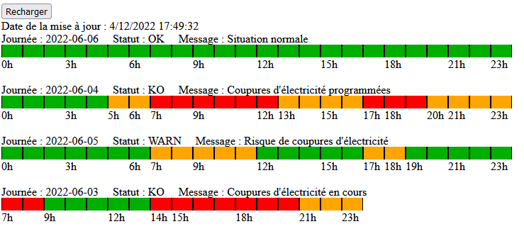

# dashboard-ecowatt

Projet pour consulter l'ecowatt de RTE.



Le projet a été fait avec Spring Boot 3.0, Java 17 et Angular 15.

Pour builder :
```shell
mvn clean install
```

Pour l'executer :
```shell
java -jar backend-1.0.0.jar
```

Il faut creer un fichier de configuration avec les paramètres:

```yml
app:
  urlOAuth2: https://digital.iservices.rte-france.com/token/oauth/
  urlEcowatt: https://digital.iservices.rte-france.com/open_api/ecowatt/v4/sandbox/signals
  secretKey:
  path: ./data
  filename: lastcall.json
  dureeCache: 15m
```

Pour le paramètre l'url app.urlEcowatt, il faut mettre l'url de RTE :
* https://digital.iservices.rte-france.com/open_api/ecowatt/v4/sandbox/signals  (pour tester)
* https://digital.iservices.rte-france.com/open_api/ecowatt/v4/signals

Pour la cle secrete, il faut la créer sur RTE.
L'api limite les appels à un appel pour 15 minutes.
Le fichier permet de limiter les appels vers le serveur de RTE.

La description de l'api est [ici](https://data.rte-france.com/catalog/-/api/doc/user-guide/Ecowatt/4.0)

